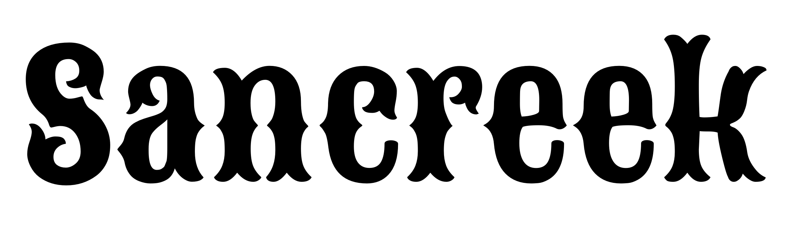
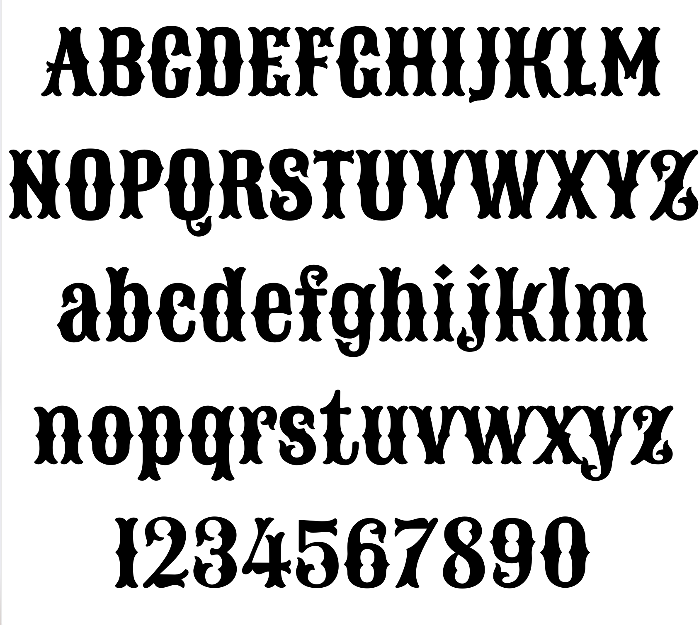

# Sancreek
By Vernon Adams

Sancreek has been designed for use mostly as a caps-only display webfont, though lowercase characters have also been included. Sancreek is a contemporary take on some of the large wooden poster fonts of the ninteenth century. Sancreek can be used freely across the internet by web browsers on desktop computers, laptops and mobile devices.

## License

Licensed under the [SIL Open Font License, 1.1](https://scripts.sil.org/OFL); you may only use these files in compliance with the License.

To contribute to the project, file an issue at https://github.com/googlefonts/sancreek